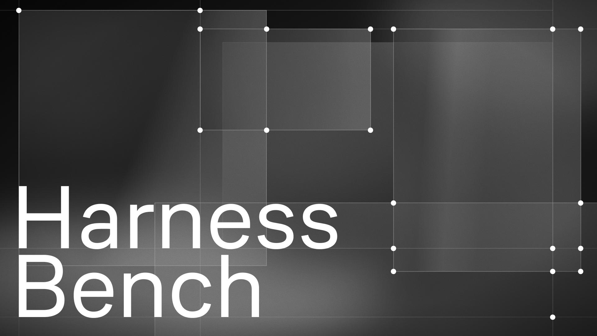

# Harness Bench



> **English version:** [docs/docs_eng/README_eng.md](docs/docs_eng/README_eng.md) · English docs: [docs/docs_eng/](docs/docs_eng/)

Фреймворк для бенчмаркинга AI-harness. Запускает агентов на наборах задач, оценивает качество ответов и отображает результаты в Web UI с историей запусков.

Поддерживает встроенные бенчмарки и **пользовательские** — достаточно написать один Python-класс и запустить на нём любого агента.

Поддерживаемые harness: hermes, openclaw, opencode, omp

## Требования

- Python 3.12+
- Docker Desktop (для запуска харнессов)
- PostgreSQL (опционально; без него история не сохраняется)

## Быстрый старт — локально

```bash
python3 -m venv .venv && source .venv/bin/activate
pip install -e .

cp configs/example.yaml configs/my_run.yaml
# отредактируй api_key, base_url, model_name

framework serve                            # Web UI как сервис на http://localhost:8765 — выбери конфиг в UI
framework serve --config configs/my_run.yaml --open-browser  # предзагрузить конфиг и открыть браузер
framework run configs/my_run.yaml          # headless-прогон (без UI)
```

Для поддержки PAC1: `pip install -e ".[pac1]"`

## Быстрый старт — Docker

```bash
cp docker/.env.example docker/.env
echo "HARNESS_HOST_WORK_DIR=$(pwd)" >> docker/.env

docker compose -f docker/docker-compose.yml --env-file docker/.env up --build -d
```

Затем открой **http://localhost:8765** — это Web UI как сервис. Выбери конфиг в выпадающем списке (или «New (defaults)»), отредактируй и запусти прогон прямо в браузере.

БД для сервиса задаётся **окружением деплоя** (docker-compose подставляет `DB_HOST=postgres` и т.д.), а не секцией `database` в выбранном конфиге — она фиксирована на всё время жизни сервиса. Для headless-прогона из консоли: `docker compose … run --rm framework framework run /app/configs/my_run.yaml`.

## Harness (агенты)

| Тип | Описание | Sandbox |
|-----|----------|---------|
| `hermes` | Hermes Agent в Docker | Да |
| `opencode` | OpenCode в Docker | Да |
| `openclaw` | OpenClaw в Docker | Да |
| `omp` | Oh My Pi в Docker через RPC | Да |
| `pac1_hermes` | Hermes + PAC1 | — |
| `pac1_opencode` | OpenCode + PAC1 | — |
| `pac1_openclaw` | OpenClaw + PAC1 | — |
| `pac1_omp` | Oh My Pi + PAC1 | — |

## Бенчмарки

| Имя | Описание | Источник |
|-----|----------|----------|
| `simpleqa` | Фактические вопросы-ответы, LLM-judge | [SimpleQA](https://github.com/openai/simple-evals) |
| `bfcl` | Function-calling (Berkeley FCL) | [BFCL](https://gorilla.cs.berkeley.edu/leaderboard.html) |
| `bfcl_memory` | Многоходовой BFCL | [BFCL](https://gorilla.cs.berkeley.edu/leaderboard.html) |
| `humaneval_plus` | Генерация кода, запуск тестов | [HumanEval+](https://github.com/evalplus/evalplus) |
| `persistbench` | Долгосрочная память, LLM-judge | [PersistBench](https://github.com/ivaxi0s/PersistBench) |
| `niah` | Needle-in-a-Haystack | [NIAH (inspect_evals)](https://github.com/UKGovernmentBEIS/inspect_evals/tree/main/src/inspect_evals/niah) |
| `swe_bench` | Исправление GitHub-issues (sandbox) | [SWE-bench](https://www.swebench.com/) |
| `swe_bench_multilingual` | SWE-Bench, мультиязычный (sandbox) | [SWE-bench](https://www.swebench.com/) |
| `theagentcompany` | Корпоративные задачи (sandbox) | [TheAgentCompany](https://github.com/TheAgentCompany/TheAgentCompany) |
| `pac1` | BitGN PAC1 (API, требует ключ) | [BitGN PAC1](https://bitgn.com/challenge/PAC) |

Подробнее: [docs/benchmarks.md](docs/benchmarks.md)

## CLI

```bash
framework serve                            # Web UI как сервис (выбор/правка конфига в браузере)
framework run configs/my_run.yaml          # headless-прогон бенчмарков
framework runs configs/my_run.yaml         # список запусков из БД
framework results RUN_ID --config configs/my_run.yaml
framework compare RUN_ID_A RUN_ID_B --config configs/my_run.yaml
framework db-init configs/my_run.yaml      # применить миграции БД вручную
framework db-runs configs/my_run.yaml      # последние 20 запусков напрямую из БД
```

## Свой бенчмарк

Можно тестировать на собственных бенчмарках. Нужно создать файл `framework/benchmarks/my_bench.py` с классом:

```python
from framework.benchmarks.base import Benchmark, register_benchmark

@register_benchmark("my_bench")
class MyBench(Benchmark):
    def load_samples(self): ...   # список задач
    def make_scorer(self): ...    # логика оценки
```

Бенчмарк появится в Web UI и отчётах автоматически. Полный гайд — [docs/adding-benchmark.md](docs/adding-benchmark.md).

## Документация

- [Конфигурация](docs/configuration.md) — все поля конфига, harness-параметры, БД, Docker env
- [Бенчмарки](docs/benchmarks.md) — детальное описание каждого бенчмарка
- [Добавить бенчмарк](docs/adding-benchmark.md) — как написать свой бенчмарк
- [Тесты](docs/testing.md) — запуск и структура тестов
- [Архитектура](docs/README.md) — C4-диаграммы, ADR, внутреннее устройство

🇬🇧 **English:** all docs are mirrored in [docs/docs_eng/](docs/docs_eng/) — see [README_eng.md](docs/docs_eng/README_eng.md) for the project overview.
