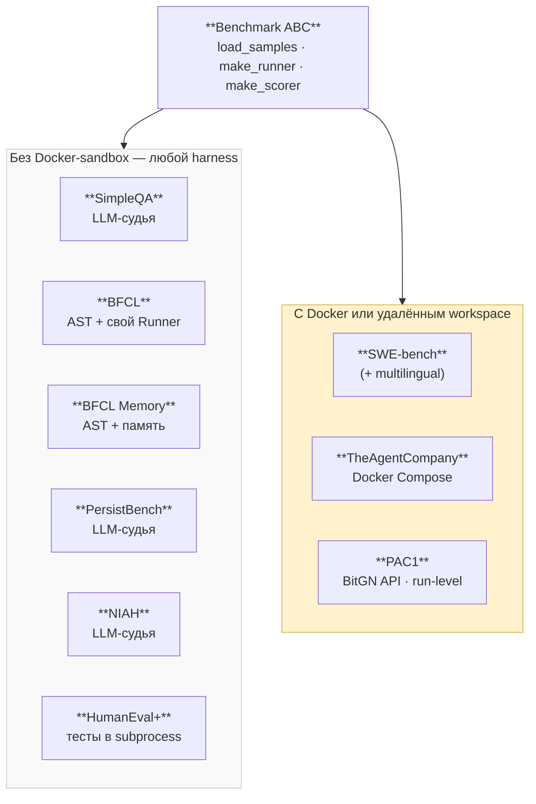
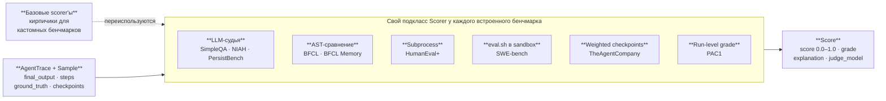
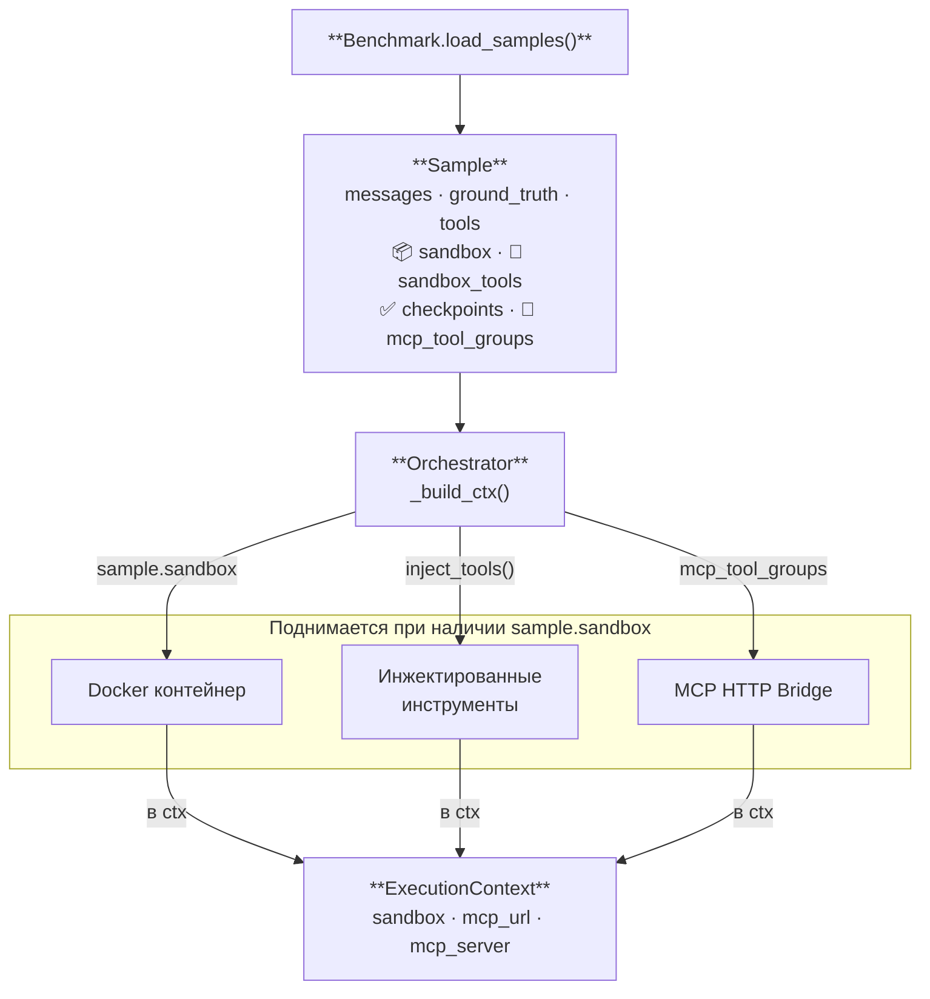

# Benchmark Components

Три диаграммы: таксономия, как работают Scorers, как Sample несёт sandbox-конфиг.

---

## 1. Таксономия бенчмарков

---

## 2. Scorers — как оцениваются ответы

**Классы scorer'ов:**

| Группа | Класс(ы) | Результат |
|--------|----------|-----------|
| Базовые (`scorers/base.py`) | ExactMatch · LLMJudge · Checkpoint · Subprocess | для кастомных бенчмарков |
| LLM-судья | `_SimpleQAScorer` · `_NIAHScorer` (рубрика 1/3/5/7/10) · `_PersistBenchScorer` | CORRECT / INCORRECT / NOT_ATTEMPTED |
| AST | `_BFCLScorer` · `_BFCLMemoryScorer` | CORRECT / INCORRECT |
| Subprocess | `_HumanEvalScorer` (без Docker) | CORRECT / INCORRECT |
| Sandbox | `SWEBenchScorer` (FAIL_TO_PASS) | CORRECT / INCORRECT |
| Sandbox | `SandboxEvalScorer` | score = Σearned / Σmax |
| Run-level | `_Pac1Scorer` (`_apply_run_grades`) | EVALUATING → реальная оценка |

---

## 3. Sample несёт sandbox-конфигурацию

**Поля Sample:** `id` · `benchmark` · `messages` · `ground_truth` · `system_prompt` · `tools` · `metadata` · `epochs` · `sandbox: SandboxSpec | None` · `sandbox_tools: list[SandboxTool]` · `checkpoints: list[Checkpoint]` · `mcp_tool_groups: list[str]`. Тип контейнера берётся из `SandboxSpec`; инжект — в `/.sandbox_tools/{name}/`.
