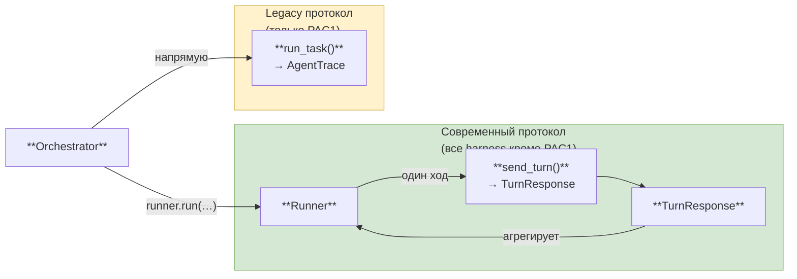
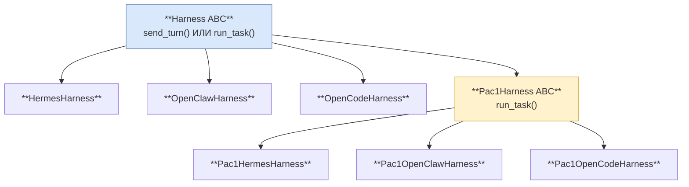
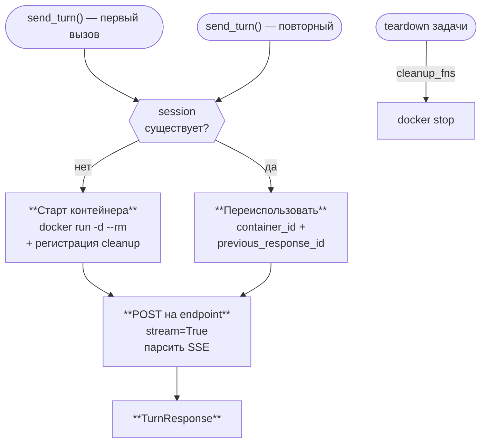

# Harness Components

Три диаграммы: два протокола, иерархия классов, жизненный цикл lazy-контейнера.

---

## 1. Два протокола выполнения

**Сигнатуры:**

| Вызов | Аргументы | Возврат |
|-------|-----------|---------|
| `runner.run(...)` | sample · send_turn · ctx | `AgentTrace` |
| `send_turn(...)` | messages · tools · system_prompt · ctx · timeout | `TurnResponse` (text · tool_calls · finish_reason · tokens · steps) |
| `run_task(...)` | task · ctx | `AgentTrace` |

---

## 2. Иерархия harness-классов

**Файлы и протоколы:** все современные harness — `supports_sandbox=True`.

| Класс | Файл | Образ / API |
|-------|------|-------------|
| HermesHarness | `hermes.py` | `nousresearch/hermes-agent` · `/v1/responses` SSE |
| OpenClawHarness | `openclaw.py` | `ghcr.io/openclaw/openclaw` · `/v1/responses` SSE |
| OpenCodeHarness | `opencode.py` | `ghcr.io/anomalyco/opencode` · `/session/{id}/message` SSE |
| Pac1Harness ABC | `pac1_base.py` | `SUPPORTS_RUNNER_PROTOCOL=False`; `run_task()` + `_run_agent()`; PcmMirror; run-level `submit_run` |
| Pac1HermesHarness | `pac1_hermes.py` | Hermes + PcmMirror |
| Pac1OpenClawHarness | `pac1_openclaw.py` | OpenClaw + PcmMirror |
| Pac1OpenCodeHarness | `pac1_opencode.py` | OpenCode + PcmMirror |

---

## 3. Lazy-старт контейнера (Hermes / OpenClaw / OpenCode)

**Детали шагов:**

| Шаг | Что происходит |
|-----|----------------|
| Старт | configure model + MCP URL → ждать готовности (`/health` · `/healthz` · `/global/health`) → сохранить session в `ctx.extras["harness_session"]`; `ctx.cleanup_fns.append(docker stop)` |
| Переиспользовать | взять `container_id` и `previous_response_id` из `ctx.extras` |
| POST | endpoint `/v1/responses` (Hermes/OpenClaw) или `/session/{id}/message` (OpenCode); парсинг SSE → text delta · function_calls · finish_reason |
| Teardown | оркестратор вызывает все `ctx.cleanup_fns` → `docker stop container_id` |
