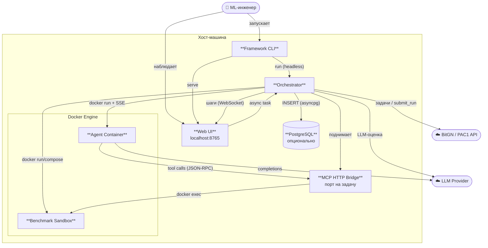

# Containers

**Технологии и жизненный цикл:**

| Контейнер | Технологии | Живёт |
|-----------|-----------|-------|
| Framework CLI | Python · Click · asyncio | весь прогон |
| Web UI | FastAPI · WebSocket · SPA | весь прогон |
| Orchestrator | asyncio · semaphore | весь прогон |
| MCP HTTP Bridge | FastAPI · JSON-RPC 2.0 | на задачу |
| Agent Container | `hermes-agent` (и др.) · `docker run --rm` | на задачу |
| Benchmark Sandbox | `docker run` / `compose up` | на задачу |
| PostgreSQL | asyncpg · единственное хранилище | постоянно |
