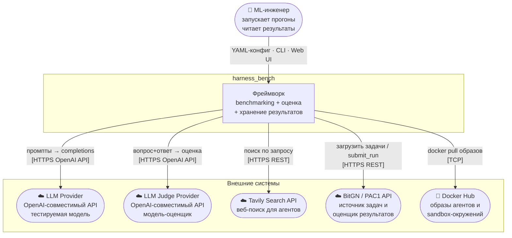

# System Context

```mermaid
flowchart TD
    Researcher(["👤 ML-инженер\nзапускает прогоны\nчитает результаты"])

    subgraph sys["harness_bench"]
        Core["Фреймворк\nbenchmarking + оценка\n+ хранение результатов"]
    end

    subgraph external["Внешние системы"]
        LLM(["☁️ LLM Provider\nOpenAI-совместимый API\nтестируемая модель"])
        Judge(["☁️ LLM Judge Provider\nOpenAI-совместимый API\nмодель-оценщик"])
        Tavily(["☁️ Tavily Search API\nвеб-поиск для агентов"])
        BitGN(["☁️ BitGN / PAC1 API\nисточник задач и\nоценщик результатов"])
        DockerHub(["🐳 Docker Hub\nобразы агентов и\nsandbox-окружений"])
    end

    Researcher -->|"YAML-конфиг · CLI · Web UI"| Core

    Core -->|"промпты → completions\n[HTTPS OpenAI API]"| LLM
    Core -->|"вопрос+ответ → оценка\n[HTTPS OpenAI API]"| Judge
    Core -->|"поиск по запросу\n[HTTPS REST]"| Tavily
    Core -->|"загрузить задачи / submit_run\n[HTTPS REST]"| BitGN
    Core -->|"docker pull образов\n[TCP]"| DockerHub
```
