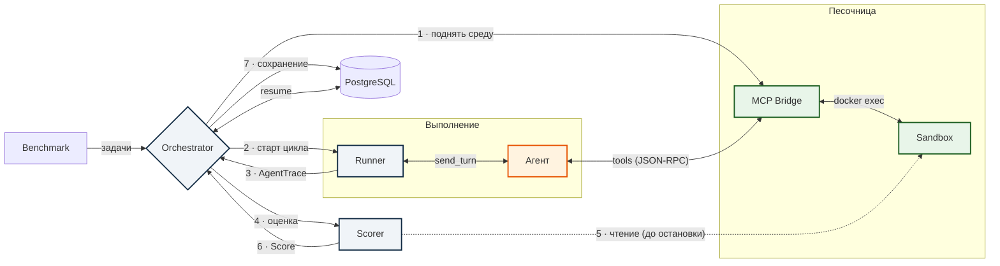

# Runtime Flow (Dynamic)

Сквозной поток выполнения одной задачи — что C4-уровни L1–L3 не показывают единой картинкой. Нумерация рёбер = порядок шагов.

| Шаг | Действие |
|-----|----------|
| 1 | Поднять sandbox + MCP Bridge (если `sample.sandbox` задан) |
| 2 | `runner.run(...)` — цикл ходов с агентом через `send_turn` |
| 3 | Runner возвращает `AgentTrace` |
| 4–6 | Scorer оценивает результат **пока sandbox жив** → `Score` |
| 7 | Сохранить `task_output` + `eval_result` в БД (no-op без PostgreSQL) |

> Связанные виды: [context](context.md) (L1) · [containers](containers.md) (L2) · [components-framework](components-framework.md) (L3, тот же жизненный цикл на уровне классов).
