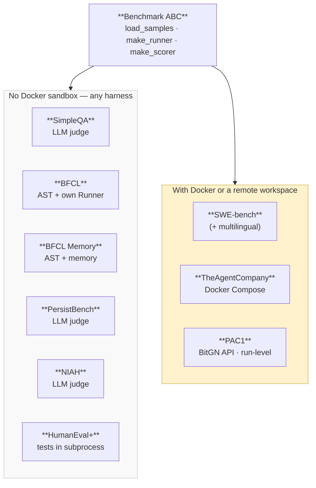
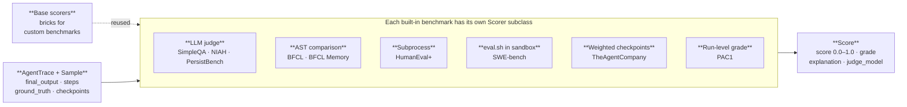
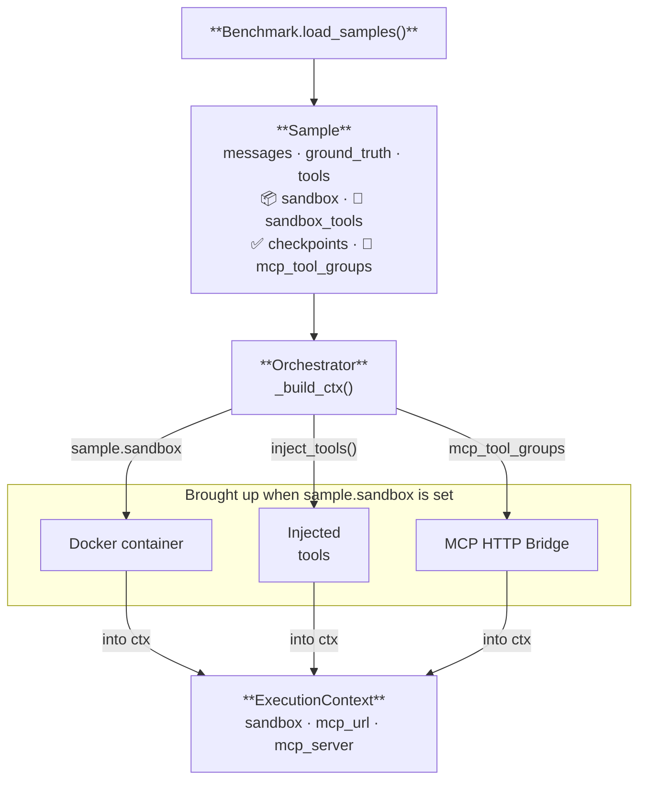

# Benchmark Components

Three diagrams: taxonomy, how Scorers work, how a Sample carries its sandbox config.

---

## 1. Benchmark taxonomy

---

## 2. Scorers — how answers are evaluated

**Scorer classes:**

| Group | Class(es) | Result |
|-------|-----------|--------|
| Base (`scorers/base.py`) | ExactMatch · LLMJudge · Checkpoint · Subprocess | for custom benchmarks |
| LLM judge | `_SimpleQAScorer` · `_NIAHScorer` (rubric 1/3/5/7/10) · `_PersistBenchScorer` | CORRECT / INCORRECT / NOT_ATTEMPTED |
| AST | `_BFCLScorer` · `_BFCLMemoryScorer` | CORRECT / INCORRECT |
| Subprocess | `_HumanEvalScorer` (no Docker) | CORRECT / INCORRECT |
| Sandbox | `SWEBenchScorer` (FAIL_TO_PASS) | CORRECT / INCORRECT |
| Sandbox | `SandboxEvalScorer` | score = Σearned / Σmax |
| Run-level | `_Pac1Scorer` (`_apply_run_grades`) | EVALUATING → real score |

---

## 3. Sample carries its sandbox config

**Sample fields:** `id` · `benchmark` · `messages` · `ground_truth` · `system_prompt` · `tools` · `metadata` · `epochs` · `sandbox: SandboxSpec | None` · `sandbox_tools: list[SandboxTool]` · `checkpoints: list[Checkpoint]` · `mcp_tool_groups: list[str]`. The container type comes from `SandboxSpec`; injection goes to `/.sandbox_tools/{name}/`.
