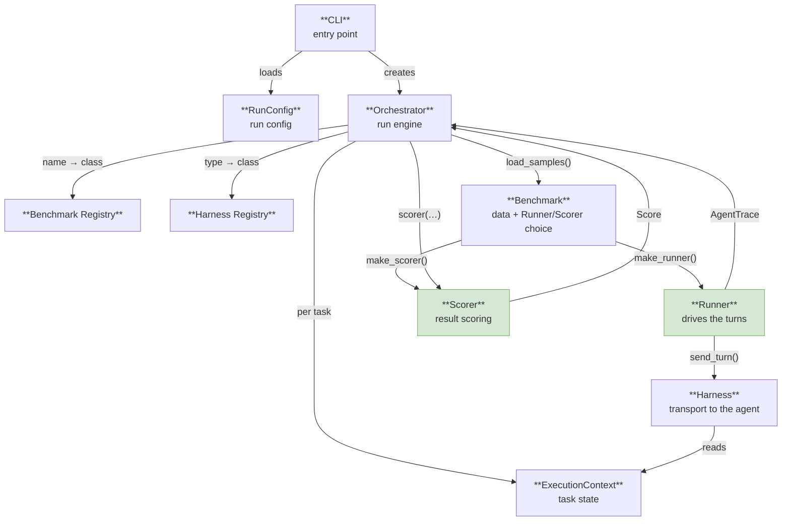
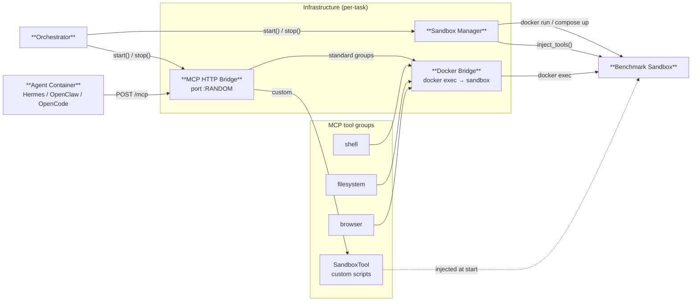
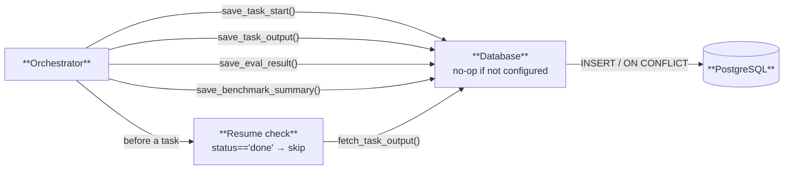

# Framework Components

Three diagrams: core, Docker/MCP infrastructure, storage.

---

## 1. Core — task lifecycle

**Files and details:**

| Component | File | Details |
|-----------|------|---------|
| RunConfig | `config.py` | Pydantic models |
| CLI | `cli.py` | Click |
| Orchestrator | `orchestrator.py` | — |
| Benchmark | `benchmarks/base.py` | `load_samples()` · `make_runner()` · `make_scorer()` |
| Runner | `runners/base.py` | `SingleTurnRunner` (default) · `BFCLRunner` |
| Harness | `harnesses/base.py` | `send_turn()` (modern) / `run_task()` (PAC1-legacy) |
| Scorer | `scorers/base.py` | ExactMatch · LLMJudge · Checkpoint · Subprocess |
| ExecutionContext | `context.py` | timeout · sandbox · mcp_url · cleanup_fns · extras |

---

## 2. Docker and MCP infrastructure

**Files and details:**

| Component | File | Details |
|-----------|------|---------|
| MCP HTTP Bridge | `mcp/http_server.py` | FastAPI, JSON-RPC 2.0, MCP 2025-11-25 |
| Docker Bridge | `mcp/docker_bridge.py` | `docker exec {container_id} {cmd}` |
| Sandbox Manager | `sandbox.py` | `@register_sandbox()` |
| Tool groups | `mcp/tools/` | `shell` · `filesystem` · `browser` |
| SandboxTool | — | from `Sample.sandbox_tools`, via `sandbox.exec_stdin()` |

---

## 3. Result storage

**Files and details:**

| Component | File | Details |
|-----------|------|---------|
| Database | `db.py` | asyncpg; no-op without config |
| PostgreSQL | — | tables: `runs` · `benchmark_runs` · `task_outputs` · `eval_results` · `schema_migrations` |
| save_task_output | — | writes `status = done/error/timeout` |
