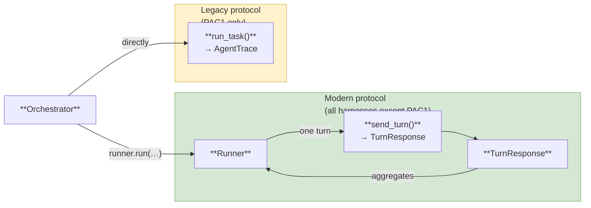
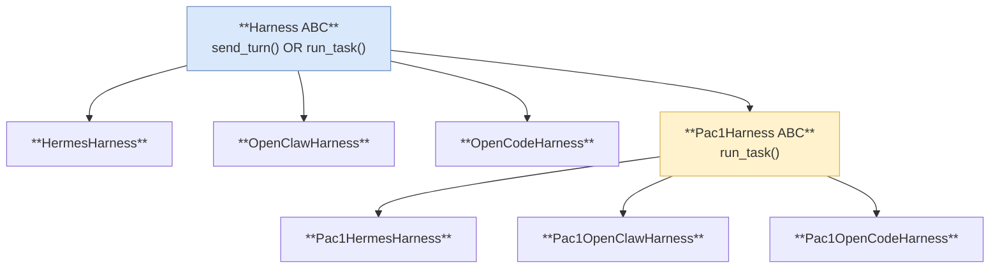
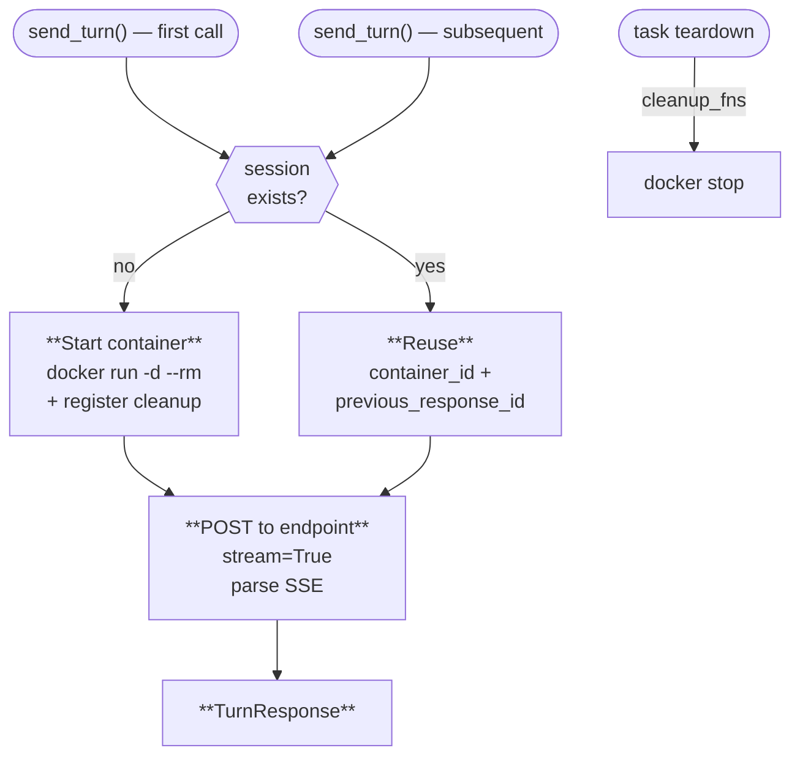

# Harness Components

Three diagrams: two protocols, class hierarchy, lazy-container lifecycle.

---

## 1. Two execution protocols

**Signatures:**

| Call | Arguments | Returns |
|------|-----------|---------|
| `runner.run(...)` | sample · send_turn · ctx | `AgentTrace` |
| `send_turn(...)` | messages · tools · system_prompt · ctx · timeout | `TurnResponse` (text · tool_calls · finish_reason · tokens · steps) |
| `run_task(...)` | task · ctx | `AgentTrace` |

---

## 2. Harness class hierarchy

**Files and protocols:** all modern harnesses are `supports_sandbox=True`.

| Class | File | Image / API |
|-------|------|-------------|
| HermesHarness | `hermes.py` | `nousresearch/hermes-agent` · `/v1/responses` SSE |
| OpenClawHarness | `openclaw.py` | `ghcr.io/openclaw/openclaw` · `/v1/responses` SSE |
| OpenCodeHarness | `opencode.py` | `ghcr.io/anomalyco/opencode` · `/session/{id}/message` SSE |
| Pac1Harness ABC | `pac1_base.py` | `SUPPORTS_RUNNER_PROTOCOL=False`; `run_task()` + `_run_agent()`; PcmMirror; run-level `submit_run` |
| Pac1HermesHarness | `pac1_hermes.py` | Hermes + PcmMirror |
| Pac1OpenClawHarness | `pac1_openclaw.py` | OpenClaw + PcmMirror |
| Pac1OpenCodeHarness | `pac1_opencode.py` | OpenCode + PcmMirror |

---

## 3. Lazy container start (Hermes / OpenClaw / OpenCode)

**Step details:**

| Step | What happens |
|------|--------------|
| Start | configure model + MCP URL → wait for readiness (`/health` · `/healthz` · `/global/health`) → save session in `ctx.extras["harness_session"]`; `ctx.cleanup_fns.append(docker stop)` |
| Reuse | take `container_id` and `previous_response_id` from `ctx.extras` |
| POST | endpoint `/v1/responses` (Hermes/OpenClaw) or `/session/{id}/message` (OpenCode); parse SSE → text delta · function_calls · finish_reason |
| Teardown | the orchestrator calls all `ctx.cleanup_fns` → `docker stop container_id` |
