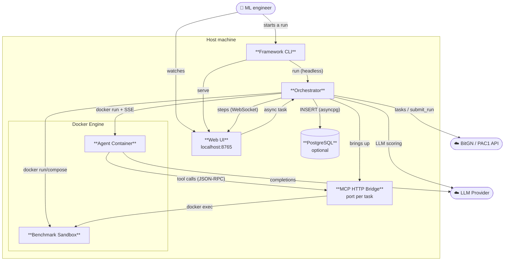

# Containers

**Technologies and lifecycle:**

| Container | Technologies | Lives |
|-----------|--------------|-------|
| Framework CLI | Python · Click · asyncio | whole run |
| Web UI | FastAPI · WebSocket · SPA | whole run |
| Orchestrator | asyncio · semaphore | whole run |
| MCP HTTP Bridge | FastAPI · JSON-RPC 2.0 | per task |
| Agent Container | `hermes-agent` (etc.) · `docker run --rm` | per task |
| Benchmark Sandbox | `docker run` / `compose up` | per task |
| PostgreSQL | asyncpg · single store | persistent |
