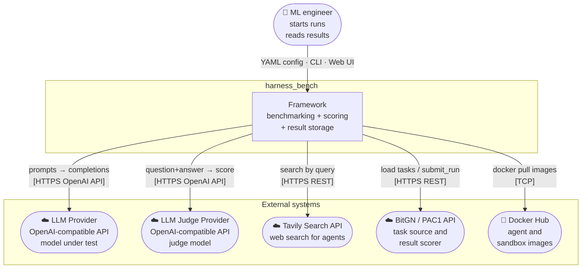

# System Context

```mermaid
flowchart TD
    Researcher(["👤 ML engineer\nstarts runs\nreads results"])

    subgraph sys["harness_bench"]
        Core["Framework\nbenchmarking + scoring\n+ result storage"]
    end

    subgraph external["External systems"]
        LLM(["☁️ LLM Provider\nOpenAI-compatible API\nmodel under test"])
        Judge(["☁️ LLM Judge Provider\nOpenAI-compatible API\njudge model"])
        Tavily(["☁️ Tavily Search API\nweb search for agents"])
        BitGN(["☁️ BitGN / PAC1 API\ntask source and\nresult scorer"])
        DockerHub(["🐳 Docker Hub\nagent and\nsandbox images"])
    end

    Researcher -->|"YAML config · CLI · Web UI"| Core

    Core -->|"prompts → completions\n[HTTPS OpenAI API]"| LLM
    Core -->|"question+answer → score\n[HTTPS OpenAI API]"| Judge
    Core -->|"search by query\n[HTTPS REST]"| Tavily
    Core -->|"load tasks / submit_run\n[HTTPS REST]"| BitGN
    Core -->|"docker pull images\n[TCP]"| DockerHub
```
