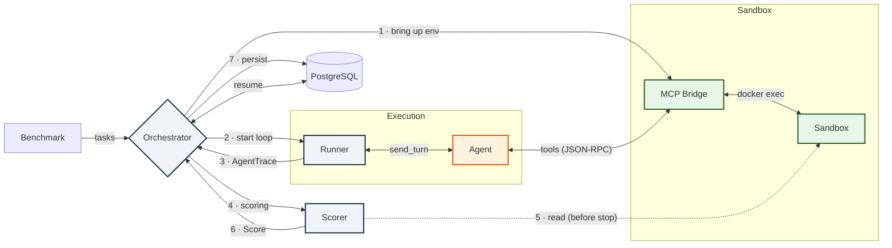

# Runtime Flow (Dynamic)

The end-to-end flow of executing one task — what the C4 levels L1–L3 don't show in a single picture. Edge numbers = step order.

| Step | Action |
|------|--------|
| 1 | Bring up the sandbox + MCP Bridge (if `sample.sandbox` is set) |
| 2 | `runner.run(...)` — turn loop with the agent via `send_turn` |
| 3 | Runner returns an `AgentTrace` |
| 4–6 | The Scorer evaluates the result **while the sandbox is alive** → `Score` |
| 7 | Persist `task_output` + `eval_result` to the DB (no-op without PostgreSQL) |

> Related views: [context](context.md) (L1) · [containers](containers.md) (L2) · [components-framework](components-framework.md) (L3, the same lifecycle at the class level).
